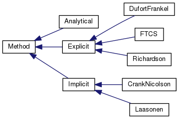
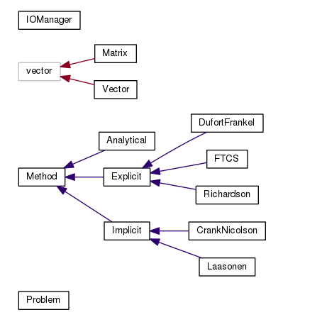
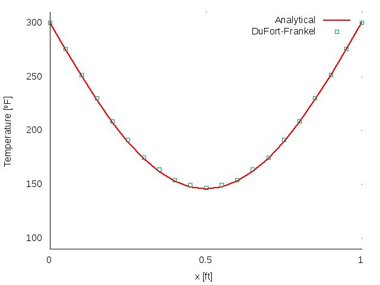

---
abstract: |
    Four numerical schemes were applied to compute a solution for a
    parabolic partial differential equation, the heat conduction equation.
    Two different types of schemes were used, explicit and implicit, and
    their solutions were evaluated. It could be observed the different
    behaviours of unstable and stable schemes. Step size variations of a
    stable method were studied as well. The obtained solutions were compared
    to the problem analytical solution in order to have a better
    understanding on these different behaviours.
author:
- |
    **António Pedro Araújo Fraga**\
    **Student ID: 279654**\
    **Cranfield University**\
    **M.Sc. in Software Engineering for Technical Computing**
title: |
    Computational Methods &
    C++\
    \[2.0cm\]

    ------------------------------------------------------------------------

    \
    **Heat Conduction Equation**

    ------------------------------------------------------------------------

    \
    \[0.5cm\]
...

  ------------------------------------------------------- ---------------------------------
  Diffusivity                                             $D$
  First derivative in time                                $\frac{\partial f}{\partial t}$
  First derivative in space                               $\frac{\partial f}{\partial x}$
  Time grid position                                      $n$
  Space grid position                                     $i$
  Function at time and space grid position                $f_i^n$
  Time step                                               $\Delta t$
  Space step                                              $\Delta x$
  Time value                                              $t$
  Space value                                             $x$
  Analytical function at specific space and time values   $f(x, t)$
  Initial Temperature                                     $T_{in}$
  Surface Temperature                                     $T_{sur}$
  ------------------------------------------------------- ---------------------------------

  : Nomenclature

Introduction {#introduction .unnumbered}
============

Numerical methods are used to obtain an approximated solution to
problems with no given analytical solution. These methods can be used in
order to save computational time, therefore they can obtain results
which are similar to the real solution more efficiently. Four different
schemes were applied to compute an approximated solution to a
**Parabolic Partial Differential Equation**, in this case the heat
conduction equation.

$
\frac{\partial f}{\partial t} = D\frac{\partial ^2 f}{\partial x^2} 
$

This condition had to be satisfied on a grid in space and time, which
means the problem has a structured mesh type, and therefore can be
represented as a grid of two dimensions. The previous equation could be
written in its discretized form for each method.

Problem definition {#problem-definition .unnumbered}
------------------

A few initial or boundary conditions were set, including the heat
conduction equation. An existing wall with **1 *ft*** thick had an
initial temperature of **100ºF** and the surface temperatures at both
sides were suddenly increased and maintained to **300ºF**. It is also
known that the wall is composed of nickel steel (40% Ni) with a
Diffusivity of **0.01 $ft ^2/h$**.

Since the wall has a 1 *ft* thickness, the problem space domain could be
restricted between **0** and **1**, and the diffusivity value, which is
considered constant, could be set to **0.01**. The time domain was
restricted between **0** to **0.5**:

$
x \in [0, 1], t \in [0, 0.5]
$

$
T_{in} = 100, T_{sur} = 300
$

$
D = 0.01
$

The initial boundaries can be formalized in mathematical expressions:

$
f(x,0) = T_{in}
$

$
f(0,t) = T_{sur}
$

$
f(1,t) = T_{sur}
$

The analytical solution of this problem was given by the following
expression:

$$f(x,t) = T_{sur} + 2(T_{in} - T_{sur}) \sum_{m=1}^{m=\infty} 
e ^{-D t (m \pi / L) ^2}  \frac{1 - (-1)^m}{m \pi} sin \left(\frac{m \pi x}{L}\right)$$

Numerical analysis {#numerical-analysis .unnumbered}
------------------

Numerical analysis is the study of the obtained solution. Criticism is
very important on this phase, since the solutions are evaluated. Digital
computers have problems with round-off errors, and since values were
truncated, problems with discretization errors may appear. There are
some definitions related with this study: stability, convergence and
approximation @convergence_stability_consistency [@numerical_analysis].

A method is declared stable if the error doesn’t grow as time advances.
Theoretically, conditions that make a scheme becomes stable or unstable
can be known.

Approximation can be verified by comparing the computed solution with
the analytical solution, and check if there is an approximation at all.

Convergence is defined by how well the computed solution approximates to
the analytical solution. This can vary with a change in the number of
**time steps** or **space steps**. A smaller number of steps can lead to
a bigger error, whereas a bigger number of steps can lead to a
considerably more time expensive solution. Every method could be
developed using **Taylor Series** @hoffman. This series were developed
for **n** terms. Thus, every method has a given approximation factor,
that could be represented in the **Big Oh** annotation. The error
related with this approximation is called **Truncation Error**
@numerical_analysis.

A quantitative analysis can be done by comparing solutions of each
method. By calculating the **norms** of the error matrix, one can
conclude which method is more accurate. The **error matrix** can be
calculated by subtracting each cell of the **analytical** solution
matrix to the cells of a method matrix. When the result is a matrix of
small values, the error is small. Whenever a norm is calculated, one is
able to translate an error matrix into a single value:

-   **One Norm** - Which is given by adding the absolute values of each
    cell of the matrix.

-   **Two Norm** - Which is obtained by adding the squares of every
    value in the matrix.

-   **Uniform Norm** - Which represents the biggest error, or the
    maximum value in the matrix.

The second norm “punishes” the biggest values, and “regards” the lowest
ones. Notice that a the square of a value between $0$ and $1$ is lower
than the given value. Whereas the square of a value bigger than 1 is
higher. Therefore, this norm is a good quality indicator.

A stencil could also be developed for each method, which relates the
several grid points, revealing the dependencies for a calculation in a
more graphical way.

Procedures {#procedures .unnumbered}
==========

Four different schemes/methods were used to compute a solution for the
given problem, two of them are explicit schemes, **Richardson**,
**DuFort-Frankel**, and two of them are implicit schemes, **Laasonen
Simple Implicit** and **Crank-Nicholson**. The space step was maintained
at **0.05** *ft*, and the time step took the value of **0.01** *h*,
studying every solutions in intervals of **0.1** hours from **0.0** to
**0.5**. The **Laasonen Simple Implicit** solution was also studied with
different time steps, always maintaining the same space step,
**$\Delta x = 0.05$**:

-   $ \Delta t = 0.01 $

-   $ \Delta t = 0.025 $

-   $ \Delta t = 0.05 $

-   $ \Delta t = 0.1 $

As referred, considering the initial equation, these methods can be
written in its discretized form.

Explicit Schemes {#explicit-schemes .unnumbered}
----------------

This type of schemes rely only on the previous time steps to calculate
the current time step solution. In the case of both used methods, they
were relying in known values of the **n - 1** and **n** time steps to
calculate a value for the **n + 1** time step. Thereby, the second time
step can not be calculated by these methods, because there’s no possible
value for a negative time step. A different method, for the same
equation, with two levels of time steps was used in order to overcome
this situation, the **Forward in Time and Central in Space** scheme.
It’s known that this method is **conditionally stable**, and its
stability condition is given by@hoffman,

$
\frac{D \Delta t}{(\Delta x)^2} \leq 0.5
$

Therefore, considering $\Delta t = 0.01$, $\Delta x = 0.05$, and
$D = 0.1$, this method is declared stable. It’s important to have a
stable solution for the first iteration, since it is a major influence
on the overall solution@heat_transfer. Therefore, this iteration could
be calculated with the following expression,

$
f_{i}^{n + 1} = f_{i}^{n} + \frac{D \Delta t}{(\Delta x)^2}(f_{i + 1}^{n} - 2f_{i}^{n} + f_{i - 1}^{n})
$

.5 {width=".8\linewidth"}

.5 {width=".8\linewidth"}

### Richardson {#richardson .unnumbered}

The Richardson method can be applied by having a central in time and
central in space scheme. Regarding to stability issues, this method is
unconditionally unstable. This method is of order **O($\Delta x ^2$,
$\Delta t ^2$)** @hoffman. Following the heat conduction equation, the
expression could be represented at **Figure 2** and could be written as
following:

$
\frac{f_i^{n + 1} - f_i^{n - 1}}{2 \Delta t} = D \frac{f_{i + 1}^{n} - 2f_{i}^{n} + f_{i - 1}^{n}}{(\Delta x)^2}
$

Which corresponds to,

$
f_{i}^{n + 1} = f_{i}^{n - 1} - \frac{2\Delta t D}{(\Delta x)^2} (f_{i + 1}^{n} - 2 f_{i}^{n} + f_{i - 1}^{n})
$

### DuFort-Frankel {#dufort-frankel .unnumbered}

The DuFort-Frankel scheme can be applied by having central differences
in both derivatives, but to prevent stability issues, the space
derivative term $f_i^n$ can be written as the average value of
$f_{i}^{n + 1}$ and $f_{i}^{n - 1}$. The method stencil can be observed
at **Figure 1**. Therefore this method is of order **O($\Delta x ^2$,
$\Delta t ^2$, $(\frac{\Delta t}{\Delta x}) ^2$)** @hoffman, it is
declared as unconditionally stable and it may be formulated as follows:

$
\frac{f_i^{n + 1} - f_i^{n - 1}}{2 \Delta t} = D \frac{f_{i + 1}^{n} - f_{i}^{n + 1} - f_{i}^{n - 1} + f_{i - 1}^{n}}{(\Delta x)^2}
$

Which is equivalent to,

$
f_{i}^{n + 1} = f_{i}^{n - 1} - \frac{2\Delta t D}{(\Delta x)^2} (f_{i + 1}^{n} - f_{i}^{n + 1} - f_{i}^{n - 1} + f_{i - 1}^{n})
$

Implicit Schemes {#implicit-schemes .unnumbered}
----------------

In other hand, implicit schemes rely not only on lower time steps to
calculate a solution, but also on the current time step known values.
Each time step solution can often be solved by applying the Thomas
Algorithm, which is an algorithm that can solve tridiagonal matrix
systems, $Ax = r$@thomas. This algorithm is a special case of the LU
decomposition, with a better performance. The matrix $A$ can be
decomposed in a lower triangular matrix $L$ and an upper triangular
matrix $U$, therefore $A = LU$@thomas. This algorithm consists of two
steps, the downwards phase where the equation $Lp = r$ is solved and the
upwards phase, solving $Ux = p$@thomas, obtaining a solution for $x$.

.5 {width=".8\linewidth"}

.5 {width=".8\linewidth"}

### Laasonen Simple Implicit {#laasonen-simple-implicit .unnumbered}

The time derivative is considered forward in time. Central difference is
used in space derivative, and the scheme is of order **O($\Delta x $,
$\Delta t ^2$)**@hoffman, and unconditionally stable. Concluding, the
below equation could be established, and it could be represented at
**Figure 3**:

$
\frac{f_i^{n + 1} - f_i^{n}}{\Delta t} = D \frac{f_{i + 1}^{n + 1} - 2f_{i}^{n + 1} + f_{i - 1}^{n + 1}}{(\Delta x)^2} 
$

Assuming that $c = \frac{\Delta t D}{(\Delta x)^2}$, the equation could
be represented as:

$
(1 - 2c)f_i^{n + 1} = f_i^n + c \left[f_{i + 1}^{n + 1} + f_{i - 1}^{n + 1}\right]
$

The values of the first and last space position of each time step are
known, they are represent by the $T_{sur}$ value. Therefore, in every
second and penultimate space step, two terms of the previous equation
could be successfully inquired. For the second space step, the equation
could be divided by having the unknown terms in the left side and the
known terms in the right side:

$
(1 - 2c)f_i^{n + 1} - c f_{i + 1}^{n + 1} = f_i^n + c f_{i - 1}^{n + 1}
$

And the same could be done for the penultimate space step:

$
(1 - 2c)f_i^{n + 1} - c f_{i - 1}^{n + 1} = f_i^n + c f_{i + 1}^{n + 1}
$

For every other space steps with unknown values, the expression could be
generalized as:

$
(1 - 2c)f_i^{n + 1} - c \left[f_{i + 1}^{n + 1} + f_{i - 1}^{n + 1}\right] = f_i^n 
$

Considering that the maximum number of space steps is **m**, the
previous expressions could form a system of linear equations, $A.x = r$:

$
\begin{bmatrix}
    (1 - 2c) & -c & 0 & 0 & \dots & 0 & 0 \\
    -c & (1 - 2c) & -c & 0 & \dots & 0 & 0 \\
    0 & -c & (1 - 2c) & -c & \dots & 0 & 0 \\
    \hdotsfor{7} \\
    0 & 0 & 0 & 0 & \dots & -c & (1 - 2c) \\
\end{bmatrix}
\begin{bmatrix}
    f_1^{n + 1} \\
    f_2^{n + 1} \\
    f_3^{n + 1} \\
    \dots \\
    f_{\textbf{m} - 1}^{n + 1} \\
\end{bmatrix}
=
\begin{bmatrix}
    f_1^{n} + c f_0^{n + 1} \\
    f_2^{n} \\
    f_3^{n} \\
    \dots \\
    f_{\textbf{m} - 1}^{n} + c f_{\textbf{m}}^{n + 1} \\
\end{bmatrix}
$

### Crank-Nicholson {#crank-nicholson .unnumbered}

The time derivative is considered forward in time, and the space
derivative can be replaced by the average of central differences in time
steps **n** and **n + 1**. The method is of order **O($\Delta x ^2$,
$\Delta t ^2$)** @hoffman, is declared unconditionally stable and it
could be represented at **Figure 4**. Thus:

$
\frac{f_i^{n + 1} - f_i^{n}}{\Delta t} = \frac{1}{2} D {\left[\frac{f_{i + 1}^{n + 1} - 2f_{i}^{n + 1} + f_{i - 1}^{n + 1}}{(\Delta x)^2} + \frac{f_{i + 1}^{n} - 2f_{i}^{n} + f_{i - 1}^{n}}{(\Delta x)^2}\right]}
$

In this method, the coefficient had a new value,
$c = \frac{1}{2}\frac{\Delta t D}{(\Delta x)^2}$, and assuming that
$p = f_{i + 1}^{n} + f_{i - 1}^{n}$, the equation could be written as
follows,

$
(1 - 2c)f_i^{n + 1} = (1 - 2c)f_i^n + c \left[f_{i + 1}^{n + 1} + f_{i - 1}^{n + 1} + p\right]
$

Following the same logical principles of the previous scheme, some
expressions could be generalized for the second,

$
(1 - 2c)f_i^{n + 1} - c f_{i + 1}^{n + 1} = (1 - 2c)f_i^n + c \left[f_{i - 1}^{n + 1} + p\right]
$

, penultimate,

$
(1 - 2c)f_i^{n + 1} - c f_{i + 1}^{n + 1} = (1 - 2c)f_i^n + c \left[f_{i + 1}^{n + 1} + p\right]
$

, and every other space steps with unknown values.

$
(1 - 2c)f_i^{n + 1} - c \left[f_{i + 1}^{n + 1} + f_{i - 1}^{n + 1}\right] = (1 - 2c)f_i^n + cp
$

Thus, a tridiagonal matrix system is obtained,

$
\begin{bmatrix}
    (1 - 2c) & -c & 0 & 0 & \dots & 0 & 0 \\
    -c & (1 - 2c) & -c & 0 & \dots & 0 & 0 \\
    0 & -c & (1 - 2c) & -c & \dots & 0 & 0 \\
    \hdotsfor{7} \\
    0 & 0 & 0 & 0 & \dots & -c & (1 - 2c) \\
\end{bmatrix}
\begin{bmatrix}
    f_1^{n + 1} \\
    f_2^{n + 1} \\
    f_3^{n + 1} \\
    \dots \\
    f_{\textbf{m} - 1}^{n + 1} \\
\end{bmatrix}
=
\begin{bmatrix}
    (1 - 2c)f_1^{n} + c \left[f_0^{n + 1} + p\right] \\
    (1 - 2c)f_2^{n} + cp \\
    (1 - 2c)f_3^{n} + cp\\
    \dots \\
    (1 - 2c)f_{\textbf{m} - 1}^{n} + c \left[f_{\textbf{m}}^{n + 1} + p\right] \\
\end{bmatrix}
$

Solution Design {#solution-design .unnumbered}
===============

The code was first planned with an initial structure and suffered
incremental upgrades. A **method** class was created, being a prototype
with multiple inheritance, containing three sub classes: **Analytical**,
**Implicit** and **Explicit**. Therefore, the **Implicit** class is an
Abstract class as well. This class has three sub classes, representing
the three explicit methods used in this problem. Similarly, the
**Implicit** class is also an abstract class, having two implicit
methods classes as sub classes. The previously described inheritance
structure can be more easily visualized on **Figure 5**.

{width=".5\linewidth"}

A Method class contains a **Problem** object. The **Problem** class
represents the Heat Conduction problem, containing informations about
the time and space steps, the solution and initial conditions.

An **Input and Output Manager** class was developed so that the code
related with plots and tables exportations could be separated from the
logical source code. This class was developed with several methods
regarding data interpretation and structuration in order to easily
export plot charts. A **gnuplot c++ library** was used, therefore the
gnuplot syntax could be directly used from the c++ code, cutting down
the need of developing external bash scripts for this specific purpose.

Despite the referred classes, a header file with useful **macros** was
declared. This file contains information about which conditions to test,
like the initial temperature and the surface temperature. Therefore, if
for some reason, one of this values changes, it can be easily corrected.

The **Matrix** and **Vector** classes, which were provided in the c++
module were reused to represent a solution matrix or a solution vector
of a certain iteration.

The several objects in this structure could be instantiated in the main
file, calling methods to compute the several solutions and to export
their plot charts. The previously described classes can be represented
in the **Figure 6** diagram.

{width=".5\linewidth"}

Results & Discussion {#results-discussion .unnumbered}
====================

The results of the four methods, **Richardson**, **DuFort-Frankel**,
**Laasonen Simple Implicit** and **Crank-Nicholson** can be seen in the
following figures/tables. These results were used to analyze each
solution quantitatively and qualitatively. In most of the plot charts,
the obtained solution was compared to the analytical solution so that it
would be possible to realize whether the solution was a good
approximation or not. Notice that the next results are regarding to the
“default” values of time and space steps, $\Delta t = 0.01$ and
$\Delta x = 0.05$.

  --------------- ------------- ------------- ------------- ------------- ------------- ------------- ------------- ------------- ------------- -- --
                      0.10          0.20          0.30          0.40          0.50          0.60          0.70          0.80          0.90         
   \[0.5ex\] 0.1   1.05136e+06     631856        123707        8417.73       300.81        8417.73       123707        631856      1.05136e+06     
        0.2        1.33245e+11    1.39e+11     7.02854e+10   2.06123e+10   6.93136e+09   2.06123e+10   7.02854e+10    1.39e+11     1.33245e+11     
        0.3        2.14659e+16   2.74969e+16   1.97012e+16   9.88337e+15   5.98161e+15   9.88337e+15   1.97012e+16   2.74969e+16   2.14659e+16     
        0.4        3.91917e+21   5.60267e+21   4.87086e+21   3.31281e+21   2.58429e+21   3.31281e+21   4.87086e+21   5.60267e+21   3.91917e+21     
        0.5        7.74272e+26   1.19047e+27   1.18021e+27   9.72231e+26   8.60626e+26   9.72231e+26   1.18021e+27   1.19047e+27   7.74272e+26     
      \[1ex\]                                                                                                                                      
  --------------- ------------- ------------- ------------- ------------- ------------- ------------- ------------- ------------- ------------- -- --

  : Richardson method error table.

By examining **Table 2**, it could be concluded that the solution given
by the Richardson method was considerably different from the analytical
solution. This was due to the fact that this method is declared as
**unconditionally unstable**. As referred before, when a method is
declared unstable, the error grows as the time advances. The error
growth was responsible for obtaining a different solution, or a solution
to a different problem. The mathematical calculations regarding the
stability and accuracy properties of this method can be found under the
appendix section.

{width=".5\linewidth"}

When looking at **Figure 7**, it can be observed that the DuFort-Frankel
solution is quite approximated to the real solution. This scheme, as it
could be observed at **Figure 11**, is more time efficient comparing to
the implicit unconditionally stable methods, the only disadvantage is
the fact that it requires a different method for the first iteration.

Similarly of what could be concluded on DuFort-Frankel results, by
observing **Figure 9** and **Figure 8**, it can also be deducted that
these are good solutions. These schemes, Crank-Nicholson and Laasonen,
are unconditionally stable as well. Therefore good results were
expected.

.5
{width=".8\linewidth"}

.5 {width=".8\linewidth"}

In other hand, when a quantitative analysis was done, it could be seen
that the Crank Nicholson scheme is more accurate than the Laasonen and
DuFort-Frankel methods. By looking at **Figure 10**, it can be observed
that the second norm value of the **Error matrix** of this scheme is
smaller than the values obtained by the other methods **Error
Matrices**.

.5 {width=".8\linewidth"}

.5 {width=".8\linewidth"}

Laasonen Implicit Scheme: study of time step variation {#laasonen-implicit-scheme-study-of-time-step-variation .unnumbered}
------------------------------------------------------

Laasonen Implicit Scheme is an unconditionally stable scheme to solve
Parabolic Partial Differential Equations. Therefore, with the right time
and space step, there’s almost no error related to the development of
its results throughout the time advancement.

A reduction on these steps led to a higher computational time, since
there’s more calculations to be made. Whereas steps with higher values
led to more inaccurate results@step_size. This phenomenon could be
explained with a concept that was introduced earlier, the **truncation
error**@hoffman. This error can only be avoided with exact calculations,
but can be reduced by applying a larger number of smaller intervals or
steps. As referred before, different results of this method were studied
by changing the time step size. The space step was maintained,
$\Delta x = 0.05$.

  ---------------- ---------- ---------- ---------- ----------- ------------ ----------- ---------- ---------- ---------- -- --
                      0.10       0.20       0.30       0.40         0.50        0.60        0.70       0.80       0.90       
   \[0.5ex\] 0.01   0.288694   0.385764   0.255427   0.0405061   -0.0611721   0.0405061   0.255427   0.385764   0.288694     
       0.025        0.738044    1.0344    0.805442   0.368491     0.157551    0.368491    0.805442    1.0344    0.738044     
        0.05        1.53627    2.15669    1.71375    0.864487     0.457364    0.864487    1.71375    2.15669    1.53627      
        0.1         3.29955    4.49523    3.46045     1.7082      0.898726     1.7082     3.46045    4.49523    3.29955      
      \[1ex\]                                                                                                                
  ---------------- ---------- ---------- ---------- ----------- ------------ ----------- ---------- ---------- ---------- -- --

  : Laasonen method error table for the several $\Delta t$ at
  $t = 0.5$

**Table 3** and **figure 12** could support the previous affirmations.
While observing **table 3**, it could be seen that the error is larger
for bigger time steps, as it was expected. Whereas when observing
**figure 12**, it can be identified a reduction in computational time as
the **time step** becomes larger.

{width=".6\linewidth"}

Conclusions {#conclusions .unnumbered}
===========

The obtained results could support the theoretical concepts. Unstable
methods demonstrated an error growth through the time progress. The
**Forward in Time, Central in Space** explicit scheme was stable with
the given initial conditions, therefore it could support a good solution
for the explicit stable scheme, **DuFort-Frankel**. As referred, the
solution of the DuFort-Frankel method strongly depends on the first
iteration solution.

It could be observed that smaller steps can lead to a time expensive
solution, whereas larger steps lead to an error increase. Stable methods
could give a good solution with the right time and space steps, but by
analysing the second norm value, it was concluded that the
Crank-Nicholson method is more accurate. This is due to the fact that
this method has a better approximation order.

It is important to have a balance between the two problems (time and
approximation), a method should be computed in an acceptable time, and
still obtain a good result. In realistic scenarios the problem solution
is not known, therefore error estimates are impractical. The used step
size should be small as possible, as long as the solution is not
dominated with round-off errors. The solution must be obtained with a
number of steps that one has time to compute.

0

Gilberto E. Urroz, July 2004, *Convergence, Stability, and Consistency
of Finite Difference Schemes in the Solution of Partial Differential
Equations,* Available at:
&lt;<http://ocw.usu.edu/Civil_and_Environmental_Engineering/Numerical_Methods_in_Civil_Engineering/StabilityNumericalSchemes.pdf>&gt;
\[Accessed 2 October 2017\]

S. Scott Collis, April 26, 2005, *An Introduction to Numerical Analysis
for Computational Fluid Mechanics,* \[Accessed 2 October 2017\]

Klaus A. Hoffman, Steve T. Chiang, August 2000, *Computational Fluid
Dynamics, Volume 1* \[Accessed 27 October 2017\]

Richard H. Pletcher, Jhon C. Tannehill, Dale A. Anderson, 2013,
*Computational Fluid Mechanics and Heat Transfer, Third Edition*,
\[Accessed 27 October 2017\]

W. T. Lee, *Tridiagonal Matrices: Thomas Algorithm*, Available at:
&lt;<https://www3.ul.ie/wlee/ms6021_thomas.pdf>&gt; \[Accessed 28
October 2017\]

*Error in Euler’s Method*, Available at:
&lt;<http://www.math.unl.edu/~gledder1/Math447/EulerError>&gt;
\[Accessed 2 November 2017\]

John D. Cook, February 22 2008, *Step size for numerical differential
equations*, Available at:
&lt;<https://www.johndcook.com/NumericalODEStepSize.pdf>&gt; \[Accessed
3 November 2017\]

B.J.P. Kaus, *Explicit versus implicit Finite Difference Schemes*,
Available at:
&lt;<https://www.geowiss.uni-mainz.de/Dateien/Finite_Differerence_Timpl_expl.pdf>&gt;
\[Accessed 4 November 2017\]

Markus Schmuck, *Numerical Methods for PDEs*, Available at:
&lt;<http://www.macs.hw.ac.uk/~ms713/lecture_9.pdf>&gt; \[Accessed 10
November 2017\]

Appendices {#appendices .unnumbered}
==========

Richardson Method Analysis {#richardson-method-analysis .unnumbered}
--------------------------

### Accuracy {#accuracy .unnumbered}

Every term can be developed with Taylor expansions:

$
f(x + \Delta t) = f_i^{n} + \Delta t \left( \frac{\partial f}{\partial t} \right)_i^n + \frac{\Delta t ^2}{2} \left( \frac{\partial ^2 f}{\partial t ^2} \right)_i^n + O(\Delta t ^3)
$

$
f(x - \Delta t)  = f_i^{n} - \Delta t \left( \frac{\partial f}{\partial t} \right)_i^n + \frac{\Delta t ^2}{2} \left( \frac{\partial ^2 f}{\partial t ^2} \right)_i^n + O(\Delta t ^3)
$

$
f(x + \Delta x)  = f_i^{n} + \Delta x \left( \frac{\partial f}{\partial x} \right)_i^n + \frac{\Delta x 2}{2} \left( \frac{\partial ^2 f}{\partial x ^2} \right)_i^n + \frac{\Delta x 3}{3} \left( \frac{\partial ^3 f}{\partial x ^3} \right)_i^n + O(\Delta x ^4)
$

$
f(x - \Delta x) = f_i^{n} - \Delta x \left( \frac{\partial f}{\partial x} \right)_i^n + \frac{\Delta x ^2}{2} \left( \frac{\partial ^2 f}{\partial x ^2} \right)_i^n - \frac{\Delta x 3}{3} \left( \frac{\partial ^3 f}{\partial x ^3} \right)_i^n + O(\Delta x ^4)
$

By replacing every term expansion in the **Richardson’s Method
equation**, one should obtain the **Heat Conduction Equation**.

Starting by the left side of the **Richardson’s Method equation**,

$
\frac{f_i^{n + 1} - f_i^{n - 1}}{2 \Delta t}
$

it can be converted into,

$
\frac{f_i^{n} + \Delta t \left( \frac{\partial f}{\partial t} \right)_i^n + \frac{\Delta t ^2}{2} \left( \frac{\partial ^2 f}{\partial t ^2} \right)_i^n + O(\Delta t ^3) - f_i^{n} + \Delta t \left( \frac{\partial f}{\partial t} \right)_i^n - \frac{\Delta t ^2}{2} \left( \frac{\partial ^2 f}{\partial t ^2} \right)_i^n + O(\Delta t ^3)}{2 \Delta t}
$

which can be translated to,

$
\left( \frac{\partial f}{\partial t} \right)_i^n + O(\Delta t ^2)
$

When looking at the right side of the equation,

$
D \frac{f_{i + 1}^{n} - 2f_{i}^{n} + f_{i - 1}^{n}}{(\Delta x)^2}
$

one can replace the terms by their expansions as well,

$
D \frac{f_i^{n} + \Delta x \left( \frac{\partial f}{\partial x} \right)_i^n + \frac{\Delta x ^2}{2} \left( \frac{\partial ^2 f}{\partial x ^2} \right)_i^n + \frac{\Delta x 3}{3} \left( \frac{\partial ^3 f}{\partial x ^3} \right)_i^n + O(\Delta x ^4) - 2f_{i}^{n} + f_i^{n} - \Delta x \left( \frac{\partial f}{\partial x} \right)_i^n + \frac{\Delta x ^2}{2} \left( \frac{\partial ^2 f}{\partial x ^2} \right)_i^n - \frac{\Delta x 3}{3} \left( \frac{\partial ^3 f}{\partial x ^3} \right)_i^n + O(\Delta x ^4)}{(\Delta x)^2}
$

which can be translated to,

$
D \left( \frac{\partial ^2 f}{\partial x ^2} \right)_i^n + O(\Delta x ^2)
$

Therefore the obtained equation is of order of
$O(\Delta x ^2, \Delta t ^2)$,

$
\left( \frac{\partial f}{\partial t} \right)_i^n - D \left( \frac{\partial ^2 f}{\partial x ^2} \right)_i^n = O(\Delta x ^2, \Delta t ^2)
$

### Stability {#stability .unnumbered}

The Richardson Scheme is given by,

$
\frac{f_i^{n + 1} - f_i^{n - 1}}{2 \Delta t} = D \frac{f_{i + 1}^{n} - 2f_{i}^{n} + f_{i - 1}^{n}}{(\Delta x)^2}
$

Using the von-Neumann analysis one can write:

$ 
f_i^{n} = \xi^n \times e^{j \omega i}
$

and by inserting this expression in the scheme, assuming that
$ q = D \frac{\Delta t}{(\Delta x)^2}$ , one obtains,

$ 
    \xi ^2 + 8 q \sin ^2( \frac{1}{2} \omega) \xi - 1 = 0
$

which is a quadratic expression, thus it can be solved with,

$ 
    \xi = -4 q \sin ^2 \frac{\omega}{2} \pm \sqrt{1 + 16 q ^2 \sin ^4 \frac{\omega}{2}}
$

assuming that $r = 4 q \sin ^2 \frac{\omega}{2} $:

$ 
    \xi = -r \pm \sqrt{1 + r ^2}
$

one will obtain $\lvert \xi \lvert > 1$ when $r > 0$, and because
stability requires that $\lvert \xi \lvert \le 1 $, the Richardson
scheme is **unconditionally unstable**.

